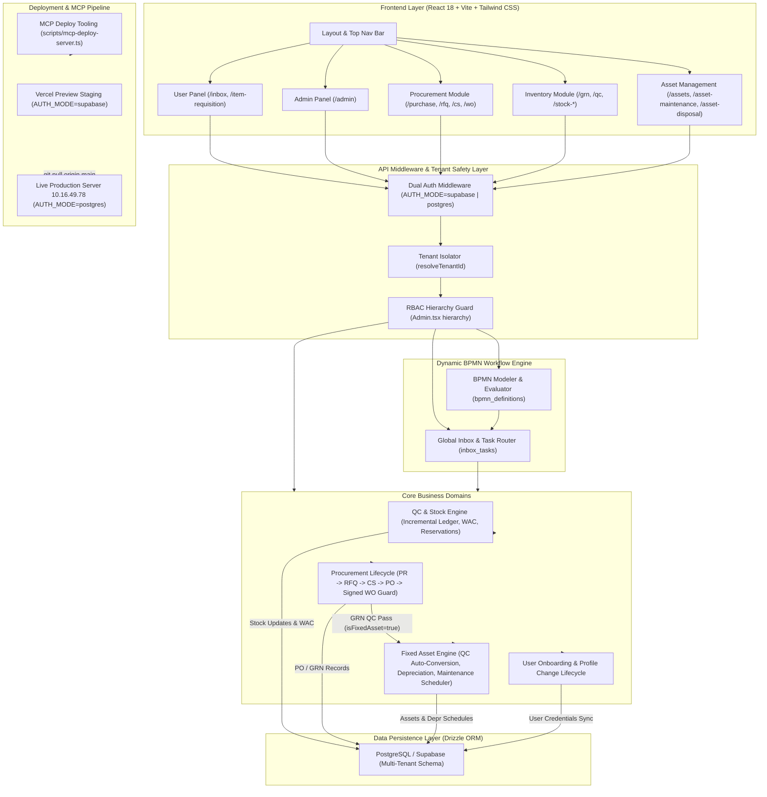

# 🚀 Developer Guide & System Architecture

Welcome to the **SLI ERP System**! This comprehensive guide provides developers with an optimized, structured overview of the system architecture, multi-tenant isolation, dynamic BPMN workflows, database schema, and core business lifecycles.

---

## 🏗️ 1. Technology Stack & Multi-Tenancy Architecture

### Tech Stack
- **Frontend**: React 18, TypeScript, Vite, Tailwind CSS
- **Backend**: Node.js, Express (TypeScript), Drizzle ORM
- **Database**: PostgreSQL (hosted on Supabase for local/Vercel; native PostgreSQL for Live Server).
- **Auth**: Dual-Authentication Architecture (`AUTH_MODE=supabase` for Supabase JWT; `AUTH_MODE=postgres` for Direct Express JWT Auth with native password verification).
- **Native Login Endpoint**: `/api/auth/login` verifies credentials directly against `users.password_hash` and issues signed JWT tokens offline.
- **Key Libraries**: `bpmn-js` (Visual BPMN Modeler), `lucide-react` (Iconography), `@azure/msal-browser` (Microsoft SSO).

### Multi-Tenancy Model
- **Tenant Isolation**: Almost all tables contain a `companyId` (UUID) column.
- **Middleware**: API requests parse the `x-tenant-id` header via `resolveTenantId(req)` in `server.ts` to restrict database queries strictly to the active company. Cross-tenant fallbacks are prohibited.
- **Role Isolation**: RBAC tables (`roles`, `role_permissions`) enforce a compound unique constraint (`companyId` + `name`) to prevent global role name collisions.
- **Role Permission Customization**: The `hierarchy` array in `Admin.tsx` maps each menu strictly to the actions it supports in the frontend/backend. Toggling a module or menu level checkbox automatically checks all corresponding nested actions for rapid onboarding.

### 🔒 Git Repository Isolation Rules
- **Workspace Scoping**: This codebase is strictly mapped to repository `https://github.com/shantalifeins/sli-erp-system.git`.
- **Pre-Push Safety Check**: Before pushing commits, agents must run `git remote -v` to confirm the destination is strictly `shantalifeins/sli-erp-system.git` to avoid cross-project contamination across multiple projects under the same GitHub account.

---

## 🔌 2. Plugin Architecture & Module Feature Flagging

- **Plugin Registry**: Modules (Procurement, Inventory, User Panel, Admin) are registered in the `plugins` table.
- **Company Feature Flagging**: `company_plugins` maps enabled modules per company tenant.
- **Route Guard**: The `PluginProtectedRoute` frontend component checks `company_plugins` before rendering module routes.
- **Seed Guard**: On server startup (`server.ts`), core plugins are auto-seeded if missing.

---

### Sidebar Matching & Top Module Navigation Tabs (`Layout.tsx`)
The `Layout` component provides both a side navigation bar and a **Top Module Navigation Tabs** bar (placed directly below the main header) for rapid horizontal module switching without returning to the main dashboard menu.

#### Top Module Navigation Bar Features:
- **Dynamic Permission Filtering**: Module tabs (`My Panel`, `System Configuration`, `Procurement`, `Inventory`, `Asset Management`) are filtered based on user permissions and tenant active plugins (identical permission mapping to `Home.tsx`).
- **Active State Highlighting**: The active module is highlighted with custom themed borders (`border-[#F37021]` for Procurement, `border-[#9F9C30]` for Inventory, `border-purple-600` for Asset Management, `border-indigo-500` for My Panel, `border-slate-700` for System Config) and soft focus rings.
- **Space-Efficient Design**: Compact horizontal scrollable bar (`py-2`) to maximize screen area for page content while leaving the sidebar "Back to Modules" button fully operational.

| Module | Active Route Matching | Sidebar & Top Tab Items |
| :--- | :--- | :--- |
| **User Panel** | `/user-dashboard`, `/inbox`, `/my-tasks`, `/item-requisition`, `/profile` | Dashboard, Global Tasks (`/inbox`), Item Requisitions, My Profile |
| **Administration** | `/admin/**` | System Settings (Companies, Workflows), User Settings (Depts, Units, Designations, Roles, Users, Org Chart) |
| **Procurement** | `/procurement-dashboard`, `/purchase`, `/wo`, `/vendors`, `/rfq`, `/cs`, `/invoices`, `/procurement-report` | Dashboard, Purchase Requisitions, RFQ, Comparative Statement, Purchase Orders, Invoices & Payments, Reports |
| **Inventory** | `/inventory-dashboard`, `/inventory`, `/grn`, `/qc`, `/stock-*`, `/requisition-list`, `/inventory-report` | Dashboard, Requisition List, Stock In, Stock Out, Stock Transfer, Transfer Receive, Goods Receipt (GRN), Inventory Reports, Inventory Settings |
| **Asset Management** | `/assets-dashboard`, `/assets`, `/asset-*` | Dashboard, Assets Register, Asset Categories, Asset Transfers (`/asset-transfers`), Depreciation Schedule, Maintenance, Disposals, Physical Audit & Verification, Financial Reports |

> [!IMPORTANT]
> - **Inbox-Based Approvals**: All actionable decisions (Approve, Reject, Send Back) occur directly in **User Panel → Global Inbox** (`/inbox`). Public pages like `/requisition-list` remain read-only.
> - **Local Header Back Navigation**: All "Add", "Edit", or "View" views implement local header back buttons (`<ArrowLeft />`) to hide form views (`setShowForm(false)`) and restore list tables.

---

## 🏛️ 3. End-to-End System Architecture & Data Flow

Below is the high-level system architecture showing component interactions, authorization middleware, the dynamic BPMN workflow engine, core business domains (including Procurement P2P, Inventory, and Asset Management), and deployment environments:

---

## 💾 4. Database Schema Domains (Drizzle ORM)

Located in `src/shared/db/schema.ts`:

### Core Domains
- **Identity & Org**: `companies`, `branches`, `warehouses`, `users` (synced via `uid`, foreign keys specify `{ onUpdate: 'cascade' }`), `departments`, `units`, `designations`, `roles`, `role_permissions`.
- **Workflow & Tasks**: `bpmn_definitions` (`documentType` + `companyId`), `document_approvals`, `pr_approvals`, `inbox_tasks` (`referenceType`, `referenceId`, `assignedToRole`, `assignedToUid`, `actionResult`).
- **Inventory & Warehouse Stock**: `inventory_items` (`isAdminItem`, `isItItem`, `isFixedAsset`, `assetCategoryId` FK → `asset_categories.id`, `quantityInStock`, `basePrice`), `item_categories`, `warehouse_stock`, `warehouse_managers`, `global_stock_ledger`, `stock_transactions`, `stock_transfers`.
- **Procurement (P2P)**: `purchase_requisitions`, `pr_items`, `vendors` (includes banking details), `rfqs`, `quotations`, `comparative_statements`, `cs_items`, `vendor_evaluations`, `purchase_orders`, `po_items`, `grn`, `grn_items`, `qc_inspections`, `invoices`, `payments`.
- **Asset Management (Fixed Assets)**: `asset_categories`, `assets` (auto-created as `Draft` upon GRN QC pass using item's `assetCategoryId`), `asset_depreciation_schedule`, `asset_transfers`, `asset_maintenance`, `asset_disposals`, `asset_physical_verifications`, `asset_verification_details`.

---

## ⚙️ 5. Dynamic BPMN Workflow Engine & Inbox Scoping

### BPMN Workflow Designer & Execution
- **Design & Evaluation**: Admins draw workflows in `WorkflowDesigner.tsx` for specific `documentType` records. Upon document submission, `evaluateWorkflowPath` parses the BPMN XML to generate approval steps.
- **Designation & Role Routing**: Approval steps map to specific roles or designations. If a step targets a "Department Head", the engine resolves `managerUid` from the requester's `departments` record.
- **Branch-Scoped Approver Lookup**: `notifyApprovers` searches for approvers matching the requester's `branchId`. If no employee is assigned in that branch, it falls back to company-wide matching or an unassigned task for Super Admins.
- **Inbox Role vs. Designation Matching**: `/api/inbox` queries use `or(eq(inbox_tasks.assignedToRole, userRole), eq(inbox_tasks.assignedToRole, userDesignation))` so tasks assigned by designation appear in the user's inbox.
- **Inbox Task Clearing**: Processing an approval step marks ALL pending `inbox_tasks` for that document as `'Completed'` across all users.

---

## 👤 6. User Onboarding & Profile Change Lifecycle

### User Registration (SSO & Admin Creation)
- Runs dynamically via `documentType: 'User Registration'`.
- Requester status remains `Pending HR Approval` during intermediate steps.
- On the **final approval step** (`isFinalStep`), the inbox UI enforces mandatory assignment of `Role`, `Branch`, `Department`, and `Designation`.
- Final approval updates status to `Active` and syncs credentials with Supabase Auth (`GoTrue`).

### Profile Data Change Requests
- Runs dynamically via `documentType: 'Profile Data Change Request'`.
- Intermediate approvers review requested profile edits.
- The **final approver** can view, edit, or override fields before final approval auto-merges changes into `users`.

---

## 🛒 7. Procurement Lifecycle (P2P) & Vendor Management

### Procurement Workflow Steps
1. **Purchase Requisition (PR)**: Created from Item Requisition List or manually. Specifies procurement method ('Single Quotation', 'Minimum 3 Quotations', 'RFQ with CS', 'Tender/RFP'). Approval flows through Operations Head → CFO.
2. **RFQ & Quotations**: Invites vendors, captures item prices, delivery days, VAT%, TAX%, and base64 quotation attachments (`attachment_url`).
3. **Comparative Statement (CS)**: Generates a quote comparison matrix. Evaluates 7 vendor criteria (Price, Quality, Timeline, Experience, Warranty, Stability, Compliance). Sequential approval gateways route based on Grand Total:
   - **≤ 5,000 BDT**: Head of Operations.
   - **5,001 – 100,000 BDT**: Head of Operations → CEO.
   - **> 100,000 BDT**: Head of Operations → CEO → EC Committee.
4. **Purchase Orders (PO)**: Generates directly from approved CS.
5. **Work Orders (WO)**: Auto-generates upon CS approval (`/work-orders`). Features pre-print customization (delivery address, contact person, numbered terms 1-7), branded Shanta Life Insurance PLC A4 PDF format with QR code (`/assets/wo_qr_code.png`) and footer bar (`/assets/wo_footer_bar.png`), signed document upload (`Signed & Active` status), and a **GRN Security Guard** (`🔒 Signed Work Order Required`) that strictly blocks GRN creation for POs without an uploaded signed Work Order.
6. **Vendor Profiles**: Stores contact info, tax IDs (BIN, TIN), and full banking details (`bank_name`, `branch_name`, `account_name`, `account_number`, `routing_number`).

---

## 📦 8. QC Inspection, Stock Ledgers & Enterprise Inventory Operations

- **Item Name Resolution**: `GET /api/grn` joins `po_items` onto `grn_items` to return `itemName`, `uom`, and unit prices.
- **Partial Inspection Badges**: `Grn.tsx` renders separate badges for accepted items (`✓ Passed (In Stock)`) and held items (`⚠️ Hold`).
- **Locked Passed Quantities**: Previously passed items are locked into stock and marked ready for payment.
- **Held-Only Re-inspection Modal**: Clicking **"Re-inspect Hold (Qty)"** opens a modal strictly scoped to held items (`🔒 Passed & Locked | ⚠️ Currently Held`), allowing newly passed items to be audited when vendor replacements arrive.
- **Incremental Stock Ledger Updates**: `POST /api/qc/inspection` calculates `newlyPassed = passedQty - previousPassedTotal`. Only newly passed items increment:
  1. `inventory_items.quantityInStock`
  2. `warehouse_stock.quantity`
  3. `global_stock_ledger.totalStockIn` & `closingBalance`

### Enterprise Inventory Gap Remediation (Phases 1-3)
- **Stock Reservation Engine (`stock_reservations`)**: Soft-locks requested stock upon pending stock-out creation to prevent double allocation. Final approval verifies `quantityInStock - reservedQuantity`, releases reservation, and records demand history in `stock_consumption_history`.
- **Physical Stock Reconciliation (`/stock-reconciliation`)**: Full physical audit lifecycle (`physical_stock_counts`, `physical_count_details`, `stock_adjustments`). Allows spot checks/cycle counts, variance logging with reason codes (Theft, Damage, Entry Error), and 1-click approval to auto-apply adjustments to warehouse and global stock.
- **QC Rejected Items & Disposition Management (`/rejected-items`)**: Auto-creates `rejected_item_dispositions` when QC inspections fail (`failedQty > 0`). Provides action UI for Return to Vendor (Credit Note # tracking), Scrap, and Rework workflows.
- **Automated Reorder PR Generation**: `POST /api/inventory/auto-reorder/generate-pr` converts low-stock items (`quantityInStock <= reorderPoint`) into a Draft Purchase Requisition with 1-click trigger from `InventoryDashboard.tsx`.
- **Bulk Upload System (`/inventory` & `/api/inventory/bulk-upload`)**:
  - `GET /api/inventory/bulk-upload/template`: Generates formatted sample `.xlsx` template with auto-column widths and sample data rows.
  - `POST /api/inventory/bulk-upload`: Accepts Base64 encoded Excel workbook; validates required fields (`itemCode`, `name`, `category`, `uom`), restricts UOMs to valid options (`Pcs`, `Kg`, `Ltr`, `Box`, `Pack`, `Mtr`, `Set`, `Unit`, `Roll`, `Pair`), validates `Item Type` (`Admin`, `IT`, `Both`), checks non-negative `basePrice`, detects in-file duplicates, and skips existing DB items (reported separately as skipped duplicates without failing the batch upload).
  - UI Component (`BulkUploadModal.tsx`): Displays 3 real-time summary stat cards (🟢 Imported, ⚠️ Skipped Duplicates, ❌ Validation Errors), an "Already Exists" yellow preview table with row numbers, and a red validation error table.
- **In-Transit Shipment Tracking**: Stock Transfer approvals set status to `In Transit` and record `dispatchDate` while deducting source warehouse stock. Destination receipt updates status to `Received` and sets `actualArrivalDate`.
- **Weighted Average Costing (WAC)**: On each GRN QC pass, recalculates unit cost: `New WAC = ((Current Qty * Current WAC) + (Received Qty * Purchase Price)) / Total Qty` and updates `inventory_items.basePrice`.
- **Vendor Quality Scorecard**: Auto-calculates `vendor_quality_metrics` (`qualityScore = (Passed / Total) * 10`, `rejectionRate`) and displays quality rating badges (e.g. ⭐ 9.8 / 10) on `Vendors.tsx`.

---

## 🎨 9. UI Conventions, Descriptive Dropdowns & Exclusion Filters

- **Mandatory Red Asterisk**: HTML5 `required` attribute triggers CSS `label:has(+ *:required)::after` to append red asterisks automatically.
- **Descriptive Entity Dropdowns**: Select dropdowns across all modules display rich context (`Number — Vendor (PO/PR) - Item Summary (Qty Pcs)`).
- **Lifecycle Exclusion Filtering**: Entity selection dropdowns filter out records that have already advanced to the next lifecycle stage:
  - **RFQ Dropdowns**: Excludes PRs with existing RFQs (`!hasRfq`).
  - **CS Dropdowns**: Excludes RFQs with existing CS records (`!hasCs`).
  - **PO Dropdowns**: Excludes CS records with existing POs (`!hasPo`).
  - **GRN Dropdowns**: Excludes POs with existing GRNs or marked Delivered (`!hasGrn`).
  - **Invoice Dropdowns**: Excludes GRNs with existing Invoices (`!hasInvoice`).
- **Dynamic Currency**: Always use `useCurrency()` hook for `{currencySymbol}` prefixing.

---

## 🔔 10. Notification System

### Notification Engine
- Templates managed dynamically in `notification_settings` table via `DEFAULT_NOTIFICATION_TEMPLATES` in `server.ts`.
- Dispatches web notifications and SMTP emails using `nodemailer` with dynamic bracket placeholders (`[document_type]`, `[approver_name]`).

---

## 🏛️ 11. Asset Management Module (Fixed Assets & Financial Lifecycle)

- **Core Asset Register (`/assets`)**: Tracks fixed asset tags (`AST-YYYYMMDD-XXXX`), acquisition cost, salvage value, useful life in months, accumulated depreciation, net book value, branch, department, custodian, GL accounts, and serial numbers.
- **Category Configuration (`/asset-categories`)**: Manages category depreciation default methods (Straight Line), useful life defaults, and GL account mappings (`assetGlAccount`, `deprGlAccount`, `accumDeprGlAccount`). Auto-seeds default category `CAT-GEN` (`General Fixed Assets`) if none exists during auto-creation.
- **Procurement Auto-Conversion**: `POST /api/qc/inspection` automatically converts passed fixed assets (`isFixedAsset = true`) into `Draft` asset records with `sourceType: 'GRN'` and acquisition cost populated from PO unit price.
- **Straight-Line & Declining Balance Depreciation Engines (`depreciationEngine.ts`)**: Auto-calculates period depreciation `(Cost - Salvage) / Useful Life` or custom declining rates with zero rounding drift adjustments applied to the final schedule period. `POST /api/assets/compute-depreciation` processes posted periods and updates book values.
- **BPMN Asset Acquisition Workflow**: Dynamic BPMN workflow for `documentType: 'Asset Acquisition'`. Submitting an asset creates pending `inbox_tasks`. Upon final approval, asset is set to `Active` and depreciation schedule rows are generated.
- **Asset Transfer & Custodian History**: `POST /api/assets/:id/transfer` initiates branch/custodian transfer. `GET /api/assets/:id/transfers` provides custodian transfer timeline history.
- **Asset Maintenance Scheduler & Cost Analytics (`/asset-maintenance`)**: Full preventive & corrective service scheduler with auto-recurrence engine (`Monthly`, `Quarterly`, `HalfYearly`, `Annually`). Automatically schedules follow-up tasks upon completion of recurring service records, updates asset `nextMaintenanceDue`, toggles asset status between `Active` and `UnderMaintenance`, tracks `Scheduled` vs `InProgress` status transitions, renders an interactive monthly **Maintenance Calendar Grid**, displays red `OVERDUE` badges for overdue tasks, provides Branch & Category global filtering, and visualizes 12-month expenditure trends and category cost shares via Recharts (`GET /api/assets/maintenance/calendar` & `GET /api/assets/maintenance/analytics`). Category defaults (`defaultMaintenanceInterval` & `defaultMaintenanceType`) pre-fill when scheduling new tasks.
- **Disposal & Write-off Workflow (`/asset-disposal`)**: Manages sale, scrap, write-off, and donation workflows for `documentType: 'Asset Disposal'`. Auto-calculates `gainLoss = saleAmount - currentBookValue`, cancels future `Scheduled` depreciation rows upon approval, and updates asset status to `Disposed` or `Sold`.
- **Asset Reports, Valuation & Expiration Alerts (`/asset-reports`)**: Provides interactive reports for Asset Register (with `Depreciation %`, `Warranty`, and `Maintenance` badges), Depreciation Schedule Summary (with Monthwise & Month Range filter controls `startMonth` / `endMonth`), Valuation Summary, and **Expiration & Alerts Tab** (`GET /api/assets/reports/alerts`). Tracks warranty expiration (<=30 days warning, expired critical) and maintenance schedules (<=7 days warning, overdue critical), includes branch-wise net book value and alert summary tables, and exports CSV reports.
- **Interactive Asset Analytics & Branch Filter Dashboard (`/assets-dashboard`)**: Consolidated analytics hub powered by `GET /api/assets/dashboard`. Features an interactive parameter filter header (Branch Location, Asset Category, Status, Custodian, Acquisition Year, Search query, and 1-click Reset Filters), 7 Key Performance Metric KPI cards (Total Asset Count, Acquisition Cost, Net Book Value, Active Assets, Draft Assets, Warranty Expiration Alerts, and Maintenance Overdue Alerts), Recharts grouped bar visualizer (Branch Valuation comparison: Acquisition Cost vs. Net Book Value), category valuation donut chart, branch location valuation breakdown table with active alert counts, and real-time filtered recently registered assets list.
- **Physical Verification Audit (`/asset-verification`)**: Manages QR/Barcode physical asset count sessions (`APV-YYYYMMDD-XXXX`), line-by-line condition audits (`Good`, `Damaged`, `NeedsRepair`, `Missing`), branch mismatch tracking (`Misplaced`), and automated missing status finalization.

---

## 🚀 12. Production Staging, Vercel & Live Server MCP Workflow

### Environment & Development Lifecycle
1. **Feature Development & Staging (Vercel + Supabase)**:
   - All new module development (e.g. Asset Management) occurs strictly on dedicated feature branches (e.g. `feature/asset-management`).
   - Commits pushed to `feature/*` branches automatically trigger **Vercel Preview Deployments** (`AUTH_MODE=supabase`) for staging review and QA testing.
   - **Zero Direct Feature Commits to `main`**: Unverified feature code MUST NEVER be committed or pushed directly to `main`.
2. **Production Hotfixes & Live Maintenance**:
   - Emergency production fixes/hotfixes for live issues are performed on dedicated hotfix branches or `main`.
3. **Production Live Server Stage (Git + MCP Deployment)**:
   - Once a feature is fully tested and verified on Vercel Preview (all phases complete), the feature branch is merged into `main` and pushed to `https://github.com/shantalifeins/sli-erp-system.git`.
   - Deployment on the live server (`10.16.49.78`) MUST ONLY occur via MCP server tooling (`scripts/mcp-deploy-server.ts`) which executes `git pull origin main`.
   - **No Direct SSH Mandate**: Direct SSH login, raw SSH execution, or storing remote passwords in codebase files is strictly forbidden.
   - **Live Database Isolation**: Runs native PostgreSQL (`AUTH_MODE=postgres`) in `sli_erp_db` inside `postgres_prod`. Supabase is NOT installed on the live server.

